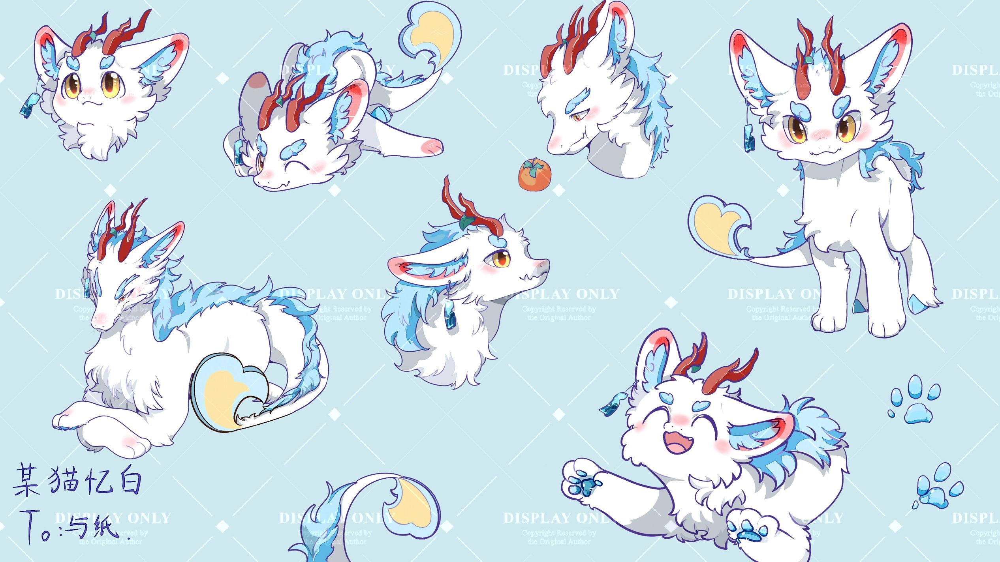

# Furry Coder Yuzhi Photo Collection 📸
This repo contains a curated collection of [@与纸Yuzhi](https://github.com/Yuzhifur)'s Public Fursuiting Photographs. Yuzhi's two original characters are Qilin Yuzhi and Qilin Goji. Anyone is free to distribute photo assets in this repo with the following credits. Distribution without the credits information is forbidden.
```
@与纸Yuzhi
github.com/Yuzhifur
Photographer: <Photographer_name>
```

## 🌈🐳 Qilin Yuzhi Introduction 🌈🐳
**与纸Yuzhi’s primary fursona**  
- Chinese name: 麒麟小与纸  
- Usually referred to simply as *“Yuzhi”*  

**Appearance**  
- Fluffy white body with **gold eyes**  
- **Mahogany wooden horns** above **blue eyebrows**  
- Flowing **sky-blue dragon mane** from head to tail  
- Tail tipped with a **wave-shaped bone extension** in blue and yellow  

**Fursuit maker:** [@与纸Yuzhi](https://github.com/Yuzhifur)  

<br>

<div align="center">

</div>

<div align="center">
<sub>Yuzhi Portrait, Apr. 5. 2025, The Quad, University of Washington, Photographer: @Jasonhistoria</sub>
</div>

<br><br>
<div align="center">

</div>

<div align="center">
<sub>Qilin Yuzhi Art Concpet, Artist: @某猫忆白</sub>
</div>


## 🌸🌾 Qilin Goji Introduction 🌸🌾
**与纸Yuzhi’s second fursona**  
- Chinese name: 麒麟晓山枸  
- Nickname *“Goji”* comes from the last character “枸” (Goji berry reference)  
- “晓山枸” is a homonym for *“Little Mountain Canid”* — a deliberate design  

**Appearance**  
- Large eyes with **blue and pink irises**
- Two horn pairs:  
  - **Small pair**: short, bud-shaped  
  - **Large pair**: branching like coral, wrapped in flowering vines  
- **Cream mane** down the back, with a small **red-ribbon ponytail**  
- **Lavender-purple fur**, cream underside, dark brown paws  
- **Tail** tipped with koi-like fin (red, cream, yellow) & flower vines  
- Accessories: **red lanterns** on ears + **gold bell** with red ribbon on neck  

**Fursuit maker:** [@梦梦 (Xiaohongshu)](https://www.xiaohongshu.com/user/profile/61873b8c000000001000ed5e)  

<br>

<div align="center">

</div>

<div align="center">
<sub>Goji Portrait, Jul. 28. 2025, Shanghai, China, Photographer: @engie</sub>
</div>

<br><br>
<div align="center">

</div>

<div align="center">
<sub>Qilin Goji Art Concpet, Artist: @与纸Yuzhi</sub>
</div>
